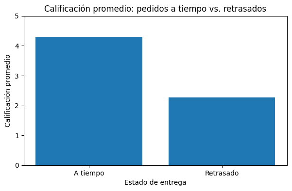
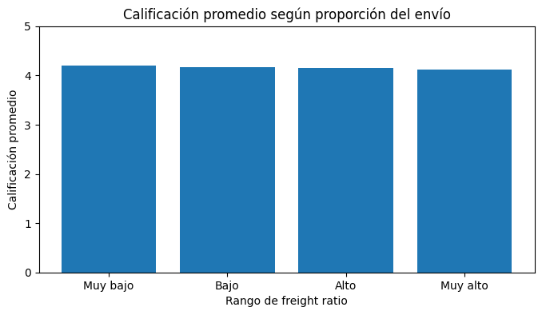
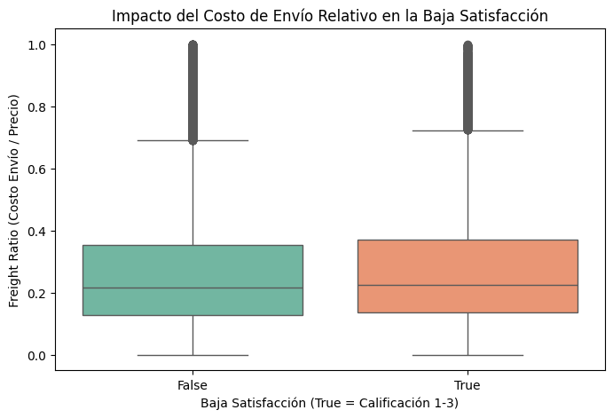
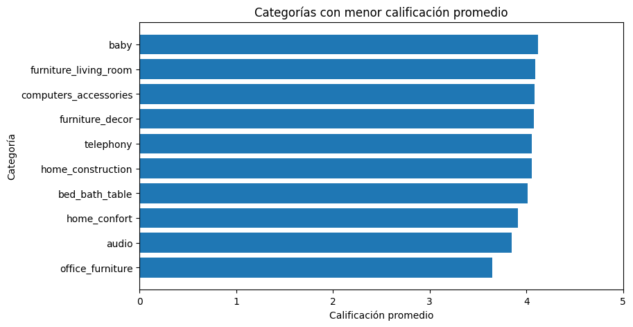
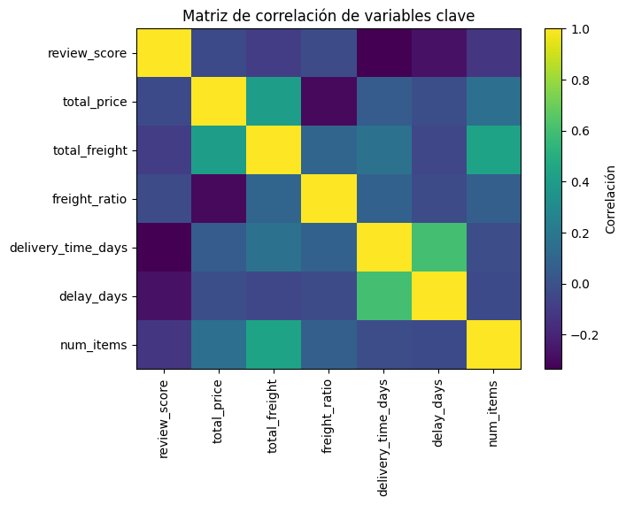
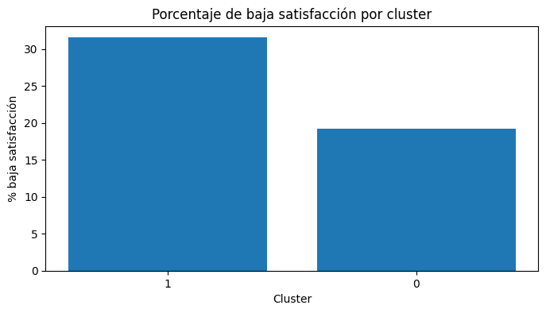

# Informe Final — ¿Qué hace que un producto triunfe en e-commerce?

**Curso:** Introducción a Data Analytics y Big Data (AD3005)  
**Proyecto final 2026-1 | PC2**  
**Caso de uso:** ¿Qué hace que un producto triunfe en e-commerce?  
**Equipo:** Valeria Ayala, Diandra Bañez, Diego Álvarez, Carlos Carrizales y Natalia Ccusi  

| Rol | Integrante |
|---|---|
| Líder de proyecto | Carlos Carrizales |
| Analista de datos | Valeria Ayala |
| Ingeniero de datos | Diego Álvarez |
| Analista de negocio | Diandra Bañez |
| Especialista en visualización y reporting | Natalia Ccusi |

**Enlaces del proyecto**  
- Notebook reproducible: `https://colab.research.google.com/drive/1V8ciuKLRDZSVSizYTovyVuSbWJTuXjWe#scrollTo=0d869cc5`
- Dashboard ejecutivo: `https://datastudio.google.com/reporting/f75a30f8-73c1-45be-8f0b-a3a5e19fc07d/page/mj30F`
- Repositorio GitHub: `https://github.com/nataliaccusiaucas/pc2.finalO`

> **Estado del informe.** Este documento contiene el análisis central de PC2. Antes de publicarlo, deben completarse los links reales, la evidencia de una fuente externa integrada y la confirmación de contribuciones reales del equipo.

---

## 1. Resumen ejecutivo

Este proyecto analiza qué variables comerciales y logísticas se asocian con la satisfacción del cliente en Olist, un marketplace brasileño de e-commerce. La decisión de negocio es determinar dónde debería priorizar la plataforma sus recursos para reducir reseñas bajas y mejorar la experiencia posterior a la compra.

Se consolidó una base de **95,824 pedidos entregados** con información de precio, flete, categoría, tiempo de entrega, retraso y calificación. El resultado principal es claro: el incumplimiento de la fecha prometida es el factor más asociado con la insatisfacción. Los pedidos entregados a tiempo alcanzaron una calificación promedio de **4.29/5** y una baja satisfacción de **17.34%**; los pedidos retrasados cayeron a **2.27/5** y **73.25%**, respectivamente.

El precio y el costo relativo de envío mostraron relaciones mucho más débiles con la calificación. La correlación entre `review_score` y `total_price` fue **-0.03**, mientras que la correlación con `freight_ratio` fue **-0.02**. Aun así, el análisis por grupos evidencia una fricción gradual: cuando el flete representa, en promedio, 8% del precio del producto, la calificación es 4.20; cuando representa 68%, baja a 4.11.

La segmentación K-Means identificó un segmento Premium de **14,043 pedidos** con ticket promedio de **317.57 BRL**, baja satisfacción de **31.55%** y tiempo medio de entrega de **13.06 días**. El informe recomienda: **(1)** reducir primero los retrasos, **(2)** crear una solución logística diferenciada para productos de mobiliario y carga pesada, y **(3)** implementar un despacho prioritario y preventivo para los pedidos Premium.

---

## 2. Problema de negocio y objetivo

### 2.1 Problema de negocio

En los marketplaces de e-commerce bajo modelos de plataformas compartidas (como Olist en Brasil), la competencia entre vendedores es interna y directa. Para destacar, los comercios no solo dependen de la calidad intrínseca de su producto, sino de un ecosistema multivariable que incluye el precio, los costos de envío, los tiempos de entrega, la categoría del producto y la atención al cliente.
Actualmente, los vendedores y administradores del marketplace operan bajo altos niveles de incertidumbre respecto al peso específico que cada una de estas variables tiene en el éxito comercial del producto. No existe un diagnóstico claro que determine qué factores (u optimizaciones combinadas) correlacionan de forma más directa con un alto volumen de ventas y con calificaciones de experiencia positivas.
Esta falta de claridad genera ineficiencias comerciales, donde los vendedores pueden estar sacrificando margen de ganancia en precios sin resolver problemas de fondo, como la fricción logística o una mala percepción de calidad en categorías específicas.

### 2.2 Pregunta de negocio

> **¿Qué variables comerciales y logísticas se relacionan con la satisfacción del cliente en Olist y qué acciones debería priorizar el marketplace para reducir la proporción de reseñas bajas?**

### 2.3 Objetivo

Identificar y cuantificar los factores comerciales y logísticos asociados a la calificación del cliente para priorizar acciones que mejoren la experiencia de compra.

### 2.4 Alcance de la conclusión

El dataset no contiene una variable directa de recompra, retención, margen ni rentabilidad. Por ello, el informe mide **satisfacción** mediante `review_score` y `low_satisfaction`; no afirma que una intervención aumentará automáticamente ventas, recompra o utilidades. Los escenarios presentados son estimaciones basadas en diferencias históricas observadas y requieren validación posterior mediante experimentos.

---

## 3. Datos y preparación

### 3.1 Fuente principal y unidad de análisis

La fuente principal fue el **Brazilian E-Commerce Public Dataset by Olist**, disponible en Kaggle. El dataset contiene pedidos, ítems, productos, clientes, vendedores, pagos, envíos y reseñas.

| Elemento | Descripción |
|---|---|
| Órdenes originales | 99,441 |
| Base analítica final | 95,824 pedidos entregados con precio, flete, fechas válidas y reseña |
| Unidad de análisis | Pedido entregado |
| Periodo | Histórico de Olist incluido en el dataset |
| Variable principal | `review_score`, en escala de 1 a 5 |
| Baja satisfacción | `low_satisfaction = 1` si `review_score ≤ 3` |

### 3.2 Tablas integradas

Se integraron las tablas de órdenes, ítems, productos, reseñas y clientes. La preparación siguió esta secuencia:

1. Se filtraron los pedidos con estado `delivered`.
2. Se convirtieron a formato fecha las variables de compra, entrega real y entrega estimada.
3. Se agregaron precio, flete y número de ítems a nivel de pedido.
4. Se integraron la categoría de producto, el puntaje de reseña y la ubicación del cliente.
5. Se excluyeron pedidos sin fecha de entrega real, reseña o valores válidos para las variables de análisis.

### 3.3 Variables creadas

| Variable | Definición | Propósito |
|---|---|---|
| `delivery_time_days` | Días desde la compra hasta la entrega real | Medir duración de entrega |
| `delay_days` | Fecha real de entrega menos fecha estimada | Medir días de adelanto o retraso |
| `is_late` | Verdadero cuando `delay_days > 0` | Identificar incumplimiento |
| `on_time_status` | “A tiempo” o “Retrasado” | Comparar grupos |
| `total_price` | Suma de precios de ítems del pedido | Medir ticket |
| `total_freight` | Suma de costo de envío | Medir costo logístico |
| `freight_ratio` | `total_freight / total_price` | Medir peso relativo del flete |
| `low_satisfaction` | Reseña entre 1 y 3 puntos | Identificar experiencia negativa |
| `purchase_month` | Mes de compra | Habilitar análisis temporal en dashboard |

### 3.4 Nota sobre el resumen descriptivo

El notebook contiene las tablas y gráficos descriptivos utilizados para caracterizar precio, flete, tiempo de entrega, retraso y calificación. Para evitar incluir cifras no verificadas, este informe presenta únicamente los resultados descriptivos que sustentan los hallazgos y escenarios de las secciones siguientes.

### 3.5 Fuente de enriquecimiento: estado actual

En la PC1 se propuso complementar el dataset con calendario comercial de Brasil, días festivos y tipo de cambio BRL/PEN. Sin embargo, la base final utilizada en el notebook no incluye variables como `is_holiday`, `season`, `is_black_friday` ni `exchange_rate`.

Por ello, esos elementos **no se usan como evidencia** en las conclusiones de este informe. La integración de un calendario de feriados de Brasil mediante `order_purchase_timestamp` es el paso pendiente más útil para completar el enriquecimiento: permitiría evaluar si temporadas de alta demanda elevan el retraso o reducen la satisfacción.

### 3.6 Limitaciones de los datos

- Solo se analizaron pedidos entregados con reseña válida; no se estudian cancelaciones ni pedidos sin feedback.
- El análisis identifica asociaciones históricas; no prueba causalidad.
- No existe una variable directa de recompra, margen o rentabilidad.
- Un pedido con varios productos fue asociado a una categoría principal agregada; las conclusiones por categoría deben interpretarse con cautela en pedidos mixtos.
- El periodo es histórico y no representa necesariamente el comportamiento actual del mercado.
- La segunda fuente externa propuesta en PC1 aún no está incorporada en el notebook.

---

## 4. Metodología de análisis

El análisis se desarrolló en cuatro niveles:

1. **Analítica descriptiva:** resumen de pedidos, calificaciones, retrasos y categorías.
2. **Analítica diagnóstica:** comparación de grupos y correlaciones para evaluar las hipótesis de PC1.
3. **Segmentación:** aplicación de K-Means para identificar segmentos de pedidos con patrones distintos.
4. **Analítica prescriptiva:** elaboración de dos escenarios “¿qué pasaría si...?” con supuestos explícitos.

La lógica del proyecto es:

> **Dato histórico → patrón observado → insight de negocio → acción priorizada → indicador de seguimiento.**

---

## 5. Resultados y validación de hipótesis

### 5.1 H1 — El retraso logístico es el principal factor asociado a la satisfacción

**Hipótesis de PC1:** ¿Los pedidos con mayor tiempo de entrega reciben calificaciones más bajas que los pedidos entregados dentro del plazo estimado?

| Estado de entrega | Pedidos | Calificación promedio | Baja satisfacción | Tiempo de entrega promedio | Retraso promedio |
|---|---:|---:|---:|---:|---:|
| A tiempo | 89,443 | 4.29 | 17.34% | 10.53 días | -13.51 días |
| Retrasado | 6,381 | 2.27 | 73.25% | 33.36 días | 10.52 días |

Los pedidos retrasados presentan una brecha de **2.02 puntos** menos en calificación promedio respecto a los pedidos entregados a tiempo. La baja satisfacción aumenta en **55.91 puntos porcentuales**: de 17.34% a 73.25%.

La matriz de correlación refuerza este resultado. `delivery_time_days` tiene una correlación de **-0.33** con `review_score` y `delay_days` una correlación de **-0.27**; ambas son las asociaciones negativas más fuertes entre las variables evaluadas.

**Conclusión H1: validada.** El cumplimiento de la promesa de entrega es la prioridad operativa más importante del análisis.

---

### 5.2 H2 — El costo relativo de envío presenta una fricción secundaria

**Hipótesis de PC1:** ¿Los costos de envío elevados reducen la satisfacción del cliente, especialmente cuando representan una proporción importante del costo total de la compra?

| Grupo de `freight_ratio` | Pedidos | Flete / precio promedio | Precio promedio (BRL) | Calificación promedio | Baja satisfacción |
|---|---:|---:|---:|---:|---:|
| Muy bajo | 23,957 | 0.08 | 296.31 | 4.20 | 19.64% |
| Bajo | 23,965 | 0.18 | 123.30 | 4.16 | 20.65% |
| Alto | 23,948 | 0.29 | 82.85 | 4.14 | 21.43% |
| Muy alto | 23,954 | 0.68 | 44.71 | 4.11 | 22.52% |

La calificación disminuye gradualmente de 4.20 a 4.11 conforme aumenta el peso relativo del flete. Sin embargo, la correlación lineal entre `freight_ratio` y `review_score` es solo **-0.02**, por lo que la asociación es débil.

En promedio, los pedidos con baja satisfacción tienen un `freight_ratio` de 0.32, frente a 0.30 en pedidos sin baja satisfacción. El flete parece generar fricción sobre todo en productos de bajo ticket, donde puede representar una proporción alta del precio.

**Conclusión H2: parcialmente validada.** Existe un patrón descriptivo, pero su magnitud es mucho menor que la del retraso. No se recomienda una política general de subsidio de envío sin prueba previa.

---

### 5.3 H3 — Las categorías no tienen el mismo desempeño

**Hipótesis de PC1:** ¿Existen categorías de productos que obtienen mejores calificaciones que otras debido a diferencias en expectativas del cliente, características del producto y desempeño logístico?

Para reducir ruido, se analizaron categorías con al menos 300 pedidos.

| Categoría crítica | Pedidos | Calificación promedio | Baja satisfacción | Tiempo de entrega promedio |
|---|---:|---:|---:|---:|
| `office_furniture` | 1,236 | 3.65 | 36.25% | 20.17 días |

`office_furniture` presenta la calificación más baja entre las categorías masivas analizadas. Su tiempo promedio de entrega es 20.17 días, casi el doble que el promedio de los pedidos a tiempo (10.53 días).

**Conclusión H3: validada.** Existen categorías con una experiencia claramente peor. Los productos voluminosos o complejos requieren una solución logística diferenciada; no debe aplicarse la misma estrategia de distribución a todo el catálogo.

---

### 5.4 H4 — El precio no determina de forma aislada la satisfacción

**Hipótesis de PC1:** ¿El precio del producto influye en la calificación del cliente?

| Grupo de precio | Pedidos | Precio promedio (BRL) | Calificación promedio | Baja satisfacción |
|---|---:|---:|---:|---:|
| Precio bajo | 24,101 | 28.59 | 4.22 | 19.56% |
| Precio medio-bajo | 23,815 | 63.78 | 4.18 | 20.31% |
| Precio medio-alto | 24,207 | 114.88 | 4.16 | 20.95% |
| Precio alto | 23,701 | 342.59 | 4.07 | 23.46% |

La diferencia entre los grupos extremos existe, pero la correlación directa entre `total_price` y `review_score` es apenas **-0.03**.

**Conclusión H4: no validada como efecto directo.** El precio, por sí solo, no explica la satisfacción de forma relevante. La ligera disminución observada en productos de mayor precio puede estar relacionada con mayor complejidad logística, expectativas distintas o categorías específicas.

---

### 5.5 Comparación de variables clave

| Variable | Correlación con `review_score` | Interpretación |
|---|---:|---|
| `delivery_time_days` | -0.33 | A mayor tiempo de entrega, menor satisfacción |
| `delay_days` | -0.27 | Incumplir la promesa de entrega reduce la calificación |
| `num_items` | -0.12 | Relación negativa leve |
| `total_freight` | -0.09 | Relación negativa débil |
| `total_price` | -0.03 | Relación prácticamente nula |
| `freight_ratio` | -0.02 | Relación lineal prácticamente nula |

La evidencia muestra que el tiempo y el retraso afectan mucho más la experiencia percibida que el precio o el flete analizados de manera aislada.

---

## 6. Segmentación K-Means

### 6.1 Construcción del modelo

Se aplicó K-Means usando seis variables: precio total, costo de envío, proporción de flete, tiempo de entrega, días de retraso y número de ítems. Se evaluaron soluciones entre dos y seis clusters; la mejor alternativa fue **k = 2**, con un **silhouette score de 0.44**.

Un silhouette score de 0.44 indica una separación moderada: los segmentos son útiles para priorizar, aunque no deben interpretarse como perfiles completamente aislados.

### 6.2 Resultados de los clusters

| Segmento | Pedidos | Participación | Precio promedio (BRL) | Flete promedio (BRL) | Tiempo de entrega | Calificación | Baja satisfacción |
|---|---:|---:|---:|---:|---:|---:|---:|
| Cluster 0 — mercado masivo | 81,781 | 85.35% | 98.96 | 17.70 | 11.69 días | 4.22 | 19.26% |
| Cluster 1 — Premium | 14,043 | 14.65% | 317.57 | 48.62 | 13.06 días | 3.79 | 31.55% |

El Cluster 1 contiene pedidos de mayor valor y mayor flete. Aunque representa solo 14.65% de la base, tiene una baja satisfacción **12.29 puntos porcentuales** mayor que el Cluster 0.

**Insight:** los pedidos Premium deben ser monitoreados de manera preventiva, con verificación de stock, seguimiento de despacho y comunicación proactiva frente a incidencias.

---

## 7. Análisis “¿qué pasaría si...?”

Los escenarios no son predicciones garantizadas. Usan como referencia diferencias históricas entre grupos y suponen que la intervención logra acercar el desempeño del grupo intervenido al grupo de comparación.

### 7.1 Escenario 1 — Erradicación del retraso logístico crítico

**Pregunta:** ¿Qué pasaría si Olist implementa monitoreo en tiempo real, penalizaciones por incumplimiento y optimización de rutas para que los pedidos retrasados lleguen dentro del plazo estimado?

| Métrica | Situación actual: retrasados | Estándar de referencia: a tiempo | Cambio de referencia |
|---|---:|---:|---:|
| Pedidos | 6,381 | — | — |
| Calificación promedio | 2.27 | 4.29 | +2.02 puntos |
| Baja satisfacción | 73.25% | 17.34% | -55.91 p.p. |

Bajo el supuesto extremo de que los 6,381 pedidos retrasados alcanzan un comportamiento similar al grupo entregado a tiempo, la baja satisfacción podría reducirse en aproximadamente **3,568 reseñas** (`6,381 × 55.91%`).

**Interpretación:** este escenario muestra el mayor potencial de mejora. Incluso si solo se corrige una parte de los retrasos, la prioridad operacional debe ser evitar que los pedidos excedan la fecha prometida.

---

### 7.2 Escenario 2 — Despacho prioritario para el segmento Premium

**Pregunta:** ¿Qué pasaría si Olist crea un canal Express para el Cluster 1 y logra igualar su tiempo medio de entrega al del mercado masivo?

| Métrica | Cluster 1 — Premium | Cluster 0 — referencia | Cambio de referencia |
|---|---:|---:|---:|
| Pedidos | 14,043 | 81,781 | — |
| Tiempo de entrega promedio | 13.06 días | 11.69 días | -1.37 días |
| Baja satisfacción | 31.55% | 19.26% | -12.29 p.p. |
| Precio promedio | 317.57 BRL | 98.96 BRL | — |

Si el Cluster Premium redujera su tasa de baja satisfacción al nivel de referencia de 19.26%, se mejorarían aproximadamente **1,725 pedidos** de alto valor (`14,043 × 12.29%`). A un precio promedio de 317.57 BRL, dichos pedidos representan cerca de **547,800 BRL** en valor transaccional histórico.

**Interpretación:** este valor no equivale a utilidad ni a recompra garantizada. Sirve para dimensionar el valor de los pedidos donde la experiencia es más vulnerable y justificar una prueba de despacho prioritario.

---

## 8. Recomendaciones estratégicas priorizadas

| Prioridad | Recomendación | Hallazgo que la sustenta | Acción concreta | Responsable sugerido | Indicador de éxito |
|---|---|---|---|---|---|
| 1 | Reducir drásticamente los pedidos retrasados | **H1:** 73.25% de baja satisfacción en pedidos retrasados frente a 17.34% en pedidos a tiempo. | Implementar alertas de riesgo, monitoreo en tiempo real, revisión de rutas y penalizaciones a operadores con incumplimientos recurrentes. | Gerencia de Operaciones Logísticas | Reducir al menos 50% la tasa de retrasos; elevar la calificación de pedidos afectados hacia 4.0 o más. |
| 2 | Crear una red logística especializada para muebles y carga pesada | **H3:** `office_furniture` registra 3.65 de calificación, 36.25% de baja satisfacción y 20.17 días de entrega promedio. | Contratar operadores especializados o definir centros de distribución dedicados para categorías como `office_furniture`. | Gerencia de Operaciones Logísticas | Reducir en al menos 30% el tiempo de entrega de la categoría; elevar su calificación de 3.65 a más de 4.0. |
| 3 | Implementar despacho prioritario para el Cluster Premium | **K-Means:** Cluster 1 tiene 31.55% de baja satisfacción frente a 19.26% del Cluster 0. | Crear un canal Express Premium con priorización de preparación, despacho y comunicación de incidencias. | Gerencia de Experiencia del Cliente + Operaciones | Reducir la baja satisfacción del Cluster 1 desde 31.55% hacia 19.26%. |

### Recomendación secundaria: política de flete focalizada

No se recomienda subsidiar el flete de forma masiva, ya que su relación lineal con la calificación es muy baja. En su lugar, Olist podría probar ofertas focalizadas para compras de bajo ticket con `freight_ratio` alto, por ejemplo mediante umbrales de envío gratuito o bundles.

La acción debería validarse con un experimento A/B que mida calificación, conversión y, solo si se incorpora la variable, recompra.

---

## 9. Dashboard ejecutivo

El dashboard debe funcionar como una herramienta de decisión, no solo como una colección de gráficos. Cada visual responde una pregunta de negocio y debe permitir filtros por mes de compra, categoría, estado/ciudad del cliente y estado de entrega.

| Visualización | Pregunta de negocio | Decisión que permite |
|---|---|---|
| KPI cards | ¿Cuál es la calificación media, la baja satisfacción y el porcentaje de retraso? | Monitorear salud general del marketplace |
| Tendencia mensual | ¿Cómo evolucionan los pedidos y el valor transaccional a lo largo del tiempo? | Detectar cambios de demanda |
| Categorías | ¿Qué categorías combinan alto volumen con baja satisfacción? | Priorizar categorías críticas |
| Entrega vs. calificación | ¿Cómo cambia la satisfacción cuando el pedido llega tarde? | Priorizar gestión de retrasos |
| Flete relativo vs. calificación | ¿El costo de envío representa una fricción relevante? | Diseñar pruebas focalizadas de pricing |
| Clusters | ¿Qué segmentos concentran mayor riesgo de reseña baja? | Crear seguimiento preventivo |

---

## 10. Conclusiones

El análisis valida que el principal problema de experiencia del cliente en Olist no es el precio ni el flete en sí mismos: es el incumplimiento de la entrega. Un pedido retrasado tiene una calificación promedio de 2.27 y una baja satisfacción de 73.25%, frente a 4.29 y 17.34% en pedidos entregados a tiempo.

El flete relativo muestra una fricción leve, principalmente en productos de menor ticket, pero no justifica desplazar la inversión desde logística hacia subsidios generalizados. Además, `office_furniture` aparece como una categoría crítica y el Cluster Premium concentra mayor riesgo de baja satisfacción.

Por tanto, el orden recomendado de decisión es: **primero, reducir retrasos; segundo, especializar la logística de categorías complejas; tercero, proteger de manera preventiva el segmento Premium.**

---

## 11. Próximos pasos

1. Integrar y analizar una fuente externa de calendario comercial o feriados de Brasil.
2. Publicar el notebook comentado y reproducible junto con el dataset de dashboard.
3. Probar las recomendaciones con experimentos A/B y grupo de control.
4. Incorporar variables de cancelación, costo operativo, margen y recompra si se dispone de ellas.
5. Convertir los indicadores del dashboard en un monitoreo periódico para operaciones y experiencia de cliente.

---

## 12. Apéndice — Uso de inteligencia artificial

Se utilizó ChatGPT únicamente para revisar la estructura, la claridad y la coherencia del informe con los requisitos de PC2. La herramienta no generó datos ni reemplazó el análisis: las cifras, gráficos, escenarios y conclusiones fueron contrastados con el notebook y el PPT del equipo.

| Herramienta | Prompt utilizado | Finalidad | Validación realizada por el equipo |
|---|---|---|---|
| ChatGPT | “Revisa nuestro informe preliminar y el PPT del proyecto de Olist frente a la rúbrica de PC2. Indica únicamente qué secciones faltan o necesitan mejorar, qué datos no están sustentados por el análisis y cómo alinear problema, hallazgos, escenarios y recomendaciones. No inventes resultados ni modifiques cifras.” | Identificar mejoras de estructura, coherencia y cumplimiento de la rúbrica. | El equipo verificó cada sugerencia comparándola con el notebook, las tablas y las diapositivas finales. Solo se incorporaron ajustes de redacción y organización que coincidían con la evidencia del proyecto. |

## 13. Apéndice — Bitácora de contribuciones del equipo

La bitácora se consigna según el plan de trabajo de la Etapa 2 presentado por el equipo en la PC1. Las actividades, responsables y evidencias siguientes son coherentes con los roles definidos en ese avance y con los entregables elaborados para PC2.

| Semana | Actividad realizada | Responsable | Evidencia en la entrega |
|---|---|---|---|
| 7 | Integración de las tablas de Olist y revisión de la estructura de la base analítica. | Diandra Bañez | Preparación y documentación de datos en el notebook. |
| 8 | Análisis de variables clave: tiempo de entrega, retraso, flete, precio y calificación. | Valeria Ayala | Tablas y gráficos de resultados. |
| 9 | Validación de las hipótesis planteadas en PC1 mediante comparaciones de grupos y correlaciones. | Carlos Carrizales | Matriz de hipótesis y conclusiones documentadas. |
| 10 | Aplicación de segmentación K-Means y evaluación mediante silhouette score. | Diego Álvarez | Código de modelado y resultados de clusters. |
| 11 | Diseño y construcción del dashboard ejecutivo. | Natalia Ccusi | Dashboard con visualizaciones interactivas. |
| 12 | Síntesis de insights y formulación de recomendaciones estratégicas. | Valeria Ayala | Secciones de escenarios y recomendaciones del informe. |
| 13 | Preparación y ensayo de la presentación ejecutiva. | Diandra Bañez | Presentación final del equipo. |
| 14 | Revisión final y consolidación de los entregables. | Todo el equipo | Repositorio GitHub, notebook, dashboard e informe. |

